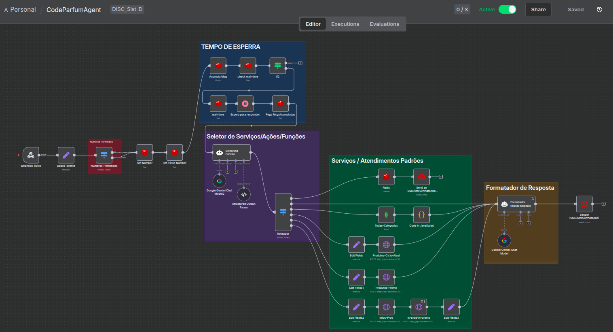
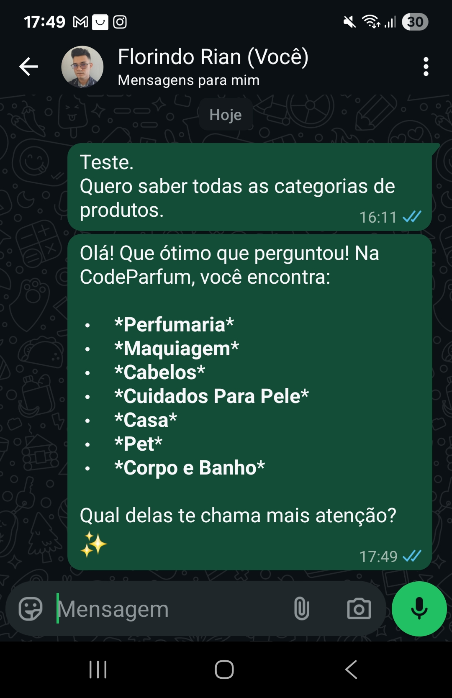

# Atendente de IA para WhatsApp - CodeParfum 🤖

Este projeto implementa um atendente virtual inteligente via **WhatsApp** para a `CodeParfum`, uma loja fictícia de perfumaria e cosméticos em geral. A solução utiliza **n8n** para orquestrar o fluxo de automação, **Gemini** como o cérebro de IA para interpretar as intenções do cliente e gerar respostas, e **Twilio** para a comunicação com o WhatsApp.

<p align="center">
    <a href="#" title="#">
        
    </a>
    <a href="#" title="#">
        
    </a>
</p>

**O atendente é capaz de:**
- Responder a dúvidas gerais sobre o negócio (horário, entrega, etc.).
- Consultar o catálogo de produtos e categorias.
- Verificar promoções ativas em um determinado ciclo de vendas.
- Fornecer informações detalhadas sobre produtos específicos.

**Propostas de valor:**
- Atendimento personalizado e vendedor
- Atendimento a um volume muito maior de clientes em comparação com um atendente humano.
- Possibilidade alavancar um negócio pequeno sem grandes custos com mão de obra humana para atendimento.

## 📋 Pré-requisitos

Antes de começar, certifique-se de que você tem as seguintes ferramentas instaladas e contas criadas:

1.  **Docker e Docker Compose:** Essencial para criar e gerenciar os contêineres da aplicação.
    -   Testado com: `Docker version 28.4.0` no Ubuntu 24.04.

2.  **ngrok:** Para criar um túnel seguro entre a sua máquina local e a internet (caso não tenha uma VPS e um nome de domínio), permitindo que o Twilio se comunique com o seu webhook do n8n.
    -   Testado com: `ngrok version 3.30.0`.
    -   Você precisará de uma conta gratuita no site do ngrok.

3.  **Google Gemini API:** Para o processamento de linguagem natural.
    -   Você precisará de uma chave de API, que pode ser obtida na Google AI Studio, conforme instruções em [./docs/Setup/gemini-apikey.md](./docs/Setup/gemini-apikey.md).

4.  **Twilio:** Para enviar e receber mensagens via WhatsApp.
    -   Você precisará de uma conta no site do Twilio.
    -   É necessário ter um número de telefone habilitado para WhatsApp.

## ⚙️ Configuração do Ambiente

Siga os passos abaixo para configurar e executar o projeto.

### 1. Variáveis de Ambiente

Existem dois arquivos de configuração de ambiente que precisam ser criados e preenchidos.

**a) Arquivo `.env` (na raiz do projeto)**

Este arquivo contém as credenciais para o n8n e a API do Gemini. Copie o arquivo `.env.example` e cole como `.env` na raíz do projeto para personalizar suas variáveis de ambiente, sendo obrigatória a mudança dos seguintes valores:

```bash
# --- CREDENCIAIS DE SERVIÇOS (Personalizar com as suas) ---
GEMINI_API_KEY="YOUR_SECRET"
MONGO_CONNECTION_STRING="YOUR_SECRET_STRING"
TWILIO_ACCOUNT_SID="YOUR_SECRET"
TWILIO_AUTH_TOKEN="YOUR_SECRET"

# Credenciais de acesso ao n8n
N8N_BASIC_AUTH_USER="TESTER"
N8N_BASIC_AUTH_PASSWORD="TESTERPASS"
```

**b) Arquivo `api-backend/.env.api`**

Este arquivo contém as credenciais para o banco de dados MongoDB e configurações do **servidor de backend**. Copie o arquivo `.env.api.example` e cole como `.env.api` na pasta `api-backend/` para personalizar suas variáveis de ambiente, sendo obrigatória a mudança dos seguintes valores:

```bash
# Credenciais do MongoDB
MONGO_CONNECTION_STRING="YOUR_SECRET_STRING"
```

### 2. Configuração do ngrok

Após instalar o ngrok, configure seu *authtoken* (disponível no dashboard do ngrok) para ter acesso a mais funcionalidades:

```bash
ngrok config add-authtoken SEU_AUTHTOKEN_AQUI
```

Toda vez que for rodar o projeto em ambiente de teste sem VPS e domínio, rode o comando abaixo para criar o túnel para a porta no seu host onde estará rodando o container do n8n. Guarde a URL gerada por ela pois irá compor a `Callback URL` a ser registrada no console do Twilio para o encaminhamento das mensagens do WhatsApp ao workflow do seu n8n, conforme explicado em [docs/Setup/twilio.md](./docs/Setup/twilio.md).

```bash
ngrok http 9000
```

### 3. Permissão de Execução

Dê permissão de execução ao script de inicialização:

```bash
chmod +x start.sh
```

### 4. Executando o Projeto

Agora, você pode iniciar todos os serviços com o script. Ele solicitará sua senha de superusuário (`sudo`) para dar permissão de execução aos scripts dentro de `setup/` para inicializar os contêineres dcoker do `compose.yml`.

```bash
./start.sh
```

⚠️ **Atenção ao Timeout do Docker:**
Ao executar o script pela primeira vez, o Docker tentará baixar as imagens necessárias. Dependendo da sua conexão, pode ocorrer um erro de *timeout*. Se isso acontecer, você pode baixar as imagens manualmente antes de rodar o script novamente:

```bash
docker pull docker.n8n.io/n8nio/n8n:1.111.1
docker pull redis:8.2.2
docker pull node:20.19.6
```

### 5. Ativando o Workflow para o modo "Produção"

Se o processo de *setup* tiver sido feito por completo e sem erros, o seguinte log será exibido no terminal:

`🎉 [n8n-init] Configuração concluída!`

Então você pode acessar o n8n via `http://localhost:9000`, realizar seu cadastro com email e senha, pular as enquetes que aparecerem e verificar se foram importados corretamente:
- **Workflow:** CodeParfumAgent
- **Credenciais:**
    - Twilio Account
    - MongoDB account
    - Evol_Gemini(PaLM)1
    - Evol-Redis1

Por fim, ao abrir o Workflow, no menu superior, habilite a opção `Active` ✅.

### 6. Configurando o Webhook no Twilio

1.  Após iniciar os serviços, o `ngrok` criará um túnel e exibirá uma URL pública (ex: `https://random-string.ngrok-free.app`).
2.  Copie essa URL e atualize a variável `N8N_HOST` no seu arquivo `.env`.
3. Na seção `Messaging > Try it out > Send a WhatsApp message` do menu lateral, clique em `Sandbox settings` para configurar o webhook do Workflow:

    - **Method**: `POST`
    - **"When a message comes in"**: cole a URL do ngrok seguida pelo caminho do webhook do n8n (sufixo: `/webhook/sistd-final`):
    `https://random-string.ngrok-free.app/webhook/sistd-final`

4.  Salve as configurações.

Pronto! Agora você pode enviar uma mensagem para o seu número WhatsApp do Twilio (em Sandbox). Após você cadastrar seu número pessoal nas configurações do Sandbox conforme orienta [docs/Setup/twilio.md](./docs/Setup/twilio.md), já será possível conversar com o atendente da CodePafum.

Experimente alguns casos de teste exemplificados em: 

- [docs/Entrega-Final/CASOS_DE_TESTE.pdf](../Entrega-Final/CASOS_DE_TESTE.pdf)
    
- [docs/Entrega-Final/CASOS_DE_TESTE_(POR_FUNCIONALIDADE).pdf](../Entrega-Final/CASOS_DE_TESTE_(POR_FUNCIONALIDADE).pdf)


## 👨‍💻 Autor

<a href="https://github.com/florindorian"></a>