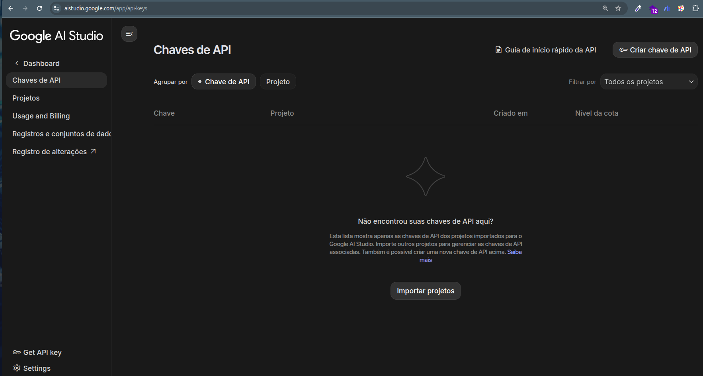

# Criar chave da API do Gemini

1. Acesse: [https://aistudio.google.com/app/api-keys](https://aistudio.google.com/app/api-keys).
2. Clique em `Criar chave de API` e dê um nome à chave. Em seguida, guarde a chave secreta gerada para uso no `.env`.

  

