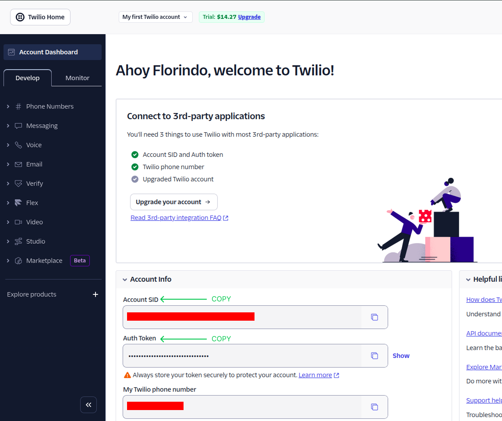
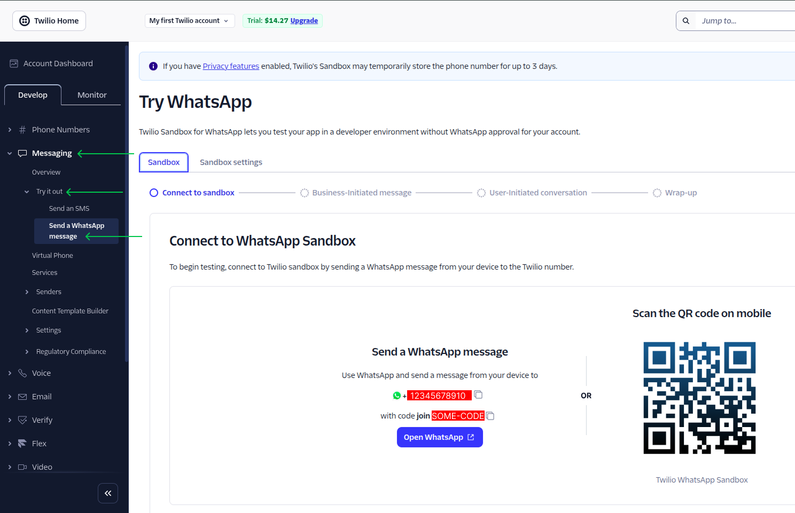
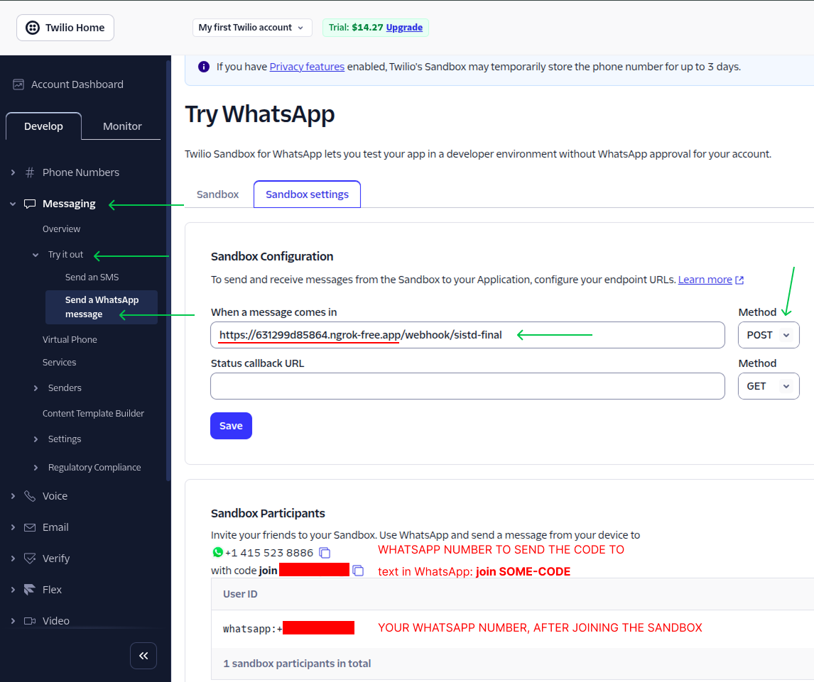

# Configurações no Twilio

1. Crie uma conta no Twilio. Você consegue testá-lo gratuitamente a partir dos US$ 15.50 que você irá receber.

2. Na Home do Console do Twilio, copie o `Account SID` e o `Account Token` e atribua-os às respectivas variáveis de ambiente no `.env`.

  

3. Na seção `Messaging > Try it out > Send a WhatsApp message` do menu lateral, adicione seu número à lista de números permitidos no Sandbox de teste para o WhatsApp conforme orientado abaixo:
    - Digite o código `join ...` mostrado a você; ou
    - Faça o scan do QR Code com o celular onde você usa o WhatsApp.

  

4.  Após iniciar os serviços, o `ngrok` criará um túnel e exibirá uma URL pública (ex: `https://random-string.ngrok-free.app`).
5.  Copie essa URL e atualize a variável `N8N_HOST` no seu arquivo `.env`.
6. Na seção `Messaging > Try it out > Send a WhatsApp message` do menu lateral, clique em `Sandbox settings` para configurar o webhook do Workflow:

    - **Method**: `POST`
    - **"When a message comes in"**: cole a URL do ngrok seguida pelo caminho do webhook do n8n (sufixo: `/webhook/sistd-final`):
    `https://random-string.ngrok-free.app/webhook/sistd-final`

7.  Salve as configurações clicando no botão `Save`.

  

8. Comece a testar o Workflow conversando com o atendente inteligente da CodeParfum. Sugestão: teste algumas mensagens de exemplo descritas em:
  - [docs/Entrega-Final/CASOS_DE_TESTE.pdf](../Entrega-Final/CASOS_DE_TESTE.pdf)
  - [docs/Entrega-Final/CASOS_DE_TESTE_(POR_FUNCIONALIDADE).pdf](../Entrega-Final/CASOS_DE_TESTE_(POR_FUNCIONALIDADE).pdf)